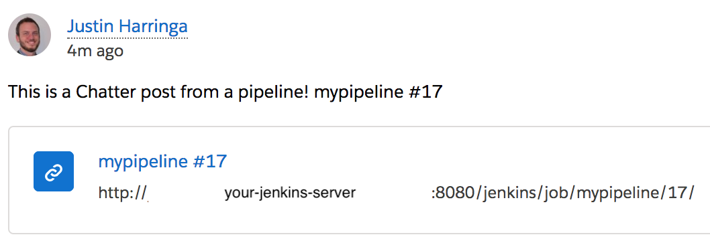

[](https://ci.jenkins.io/job/Plugins/job/chatter-notifier-plugin/job/master/)

# Chatter plugin for Jenkins

This is a plugin for Jenkins that will post build results to a Chatter feed or arbitrary text from a build step. 
You can configure it to post to a specific User (e.g. a build user), a specific group (e.g. a group that owns the build), 
or a specific record (perhaps you have a custom object that tracks build configs).

# Install

The plugin is available via the main Jenkins plugin distribution, so goto the manage Jenkins page, manage plugins, and then the available tab and search for Chatter Notifier and pick
the option to install it.

# Configure

## Send Build Results to Chatter
With the plug-in installed, and the server restarted, the build configuration page will now have an extra Post-Build 
option `Chatter Results`, if you select this, then you can populate the 4 fields as need 
(credentials (use the central Jenkins credentials tool to create one), and the recordId to post the results to, leave 
this blank to post to the users wall, or enter a record Id to post to that specific record (or group)).


### Publish Enforce coverage results

This option allows to publish the coverage results generated by [Enforce](https://github.com/fundacionjala/enforce-gradle-plugin), the post should look something like this.

```
Build: SForce-CI-Project-job 2 is SUCCESS
Coverage Result: 76.91% of code coverage, Risk status.
Coverage Status: Danger (0% - 74%): 298 files. Risk (75% - 79%): 84 files. Acceptable (80% - 94%): 267 files. Safe (95% - 100%): 277 files.
Test Result: 0 tests failing out of a total of 3,276 tests.
```

## Post to Chatter During Build
Additionally, there is a `Post to Chatter` build step which is compatible with
pipelines. You can post any arbitrary body to the feed of your Chatter user or the wall
of any recordId (e.g. Chatter group).

### Example
Sample pipeline configuration (see the snippet generator for more help getting your credentialsId):
```
node {
  chatterPost body: "This is a Chatter post from a pipeline! ${env.JOB_NAME} ${env.BUILD_DISPLAY_NAME}", credentialsId: 'JENKINS_CREDENTIAL_ID', recordId: 'SOME_RECORD_ID'
}
```
This is how your post will look:


# Build

The plugin is built with Maven, same as Jenkins itself, simply clone to repo and 
run mvn install, the generated plugin ChatterPlugin.hpi will be in the target directory.

More details on building Jenkins plugins are available on the [Jenkins Wiki](https://wiki.jenkins-ci.org/display/JENKINS/Plugin+tutorial)

# Proxy Configuration
This plugin uses the proxy configuration from Manage Jenkins -> Manage Plugins -> Advanced
The only thing that is currently not implemented is utilized is the No Proxy Hosts field.
